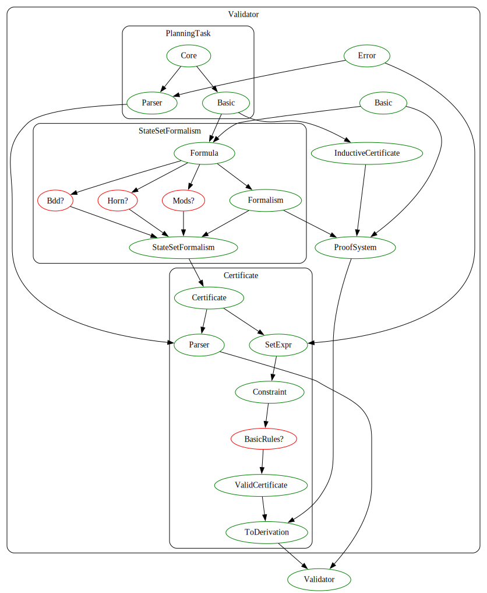

# Formally Verified Validator for Unsolvability Certificates for Automated Planning

This repository contains a validator for unsolvability certificates for automated planning, which is implemented and formally verified in Lean 4. 

The project can be build by running `make validator` or `lake build validator`, and the validator can be executed by running `lake exe validator`.

The documentation can be found at <https://amosnico.github.io/validator/docs>.

## Dependency graph of the project

## References
The certificate system behind the validator has been introduced in the following sources:
* Salomé Eriksson. *Certifying planning systems : witnesses for unsolvability*. PhD thesis. University of Basel, 2019. <https://doi.org/10.5451/unibas-007176138>
* Salomé Eriksson, Gabriele Röger and Malte Helmert. *A Proof System for Unsolvable Planning Tasks*. In: Proceedings of the International Conference on Automated Planning and Scheduling 28.1 (June 2018), pages 65–73. <https://doi.org/10.1609/icaps.v28i1.13899>
